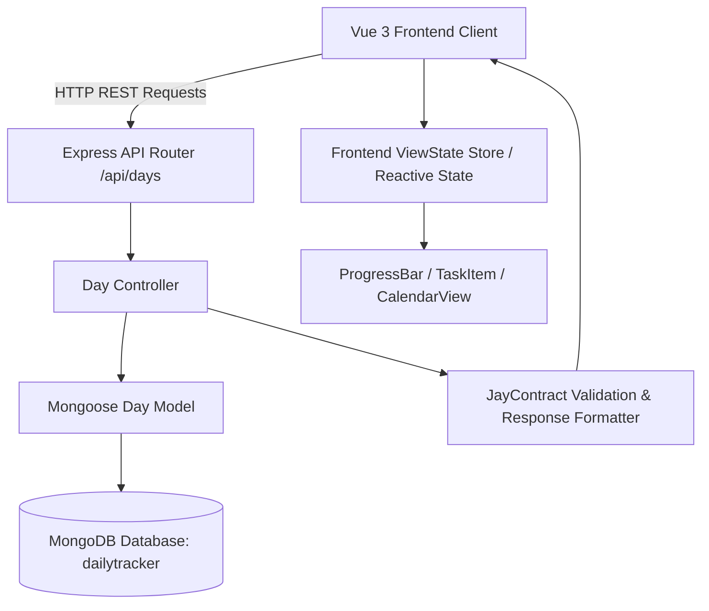
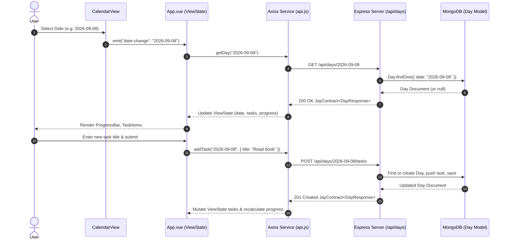

# Design Log #0001: Daily Tracker Full Stack System Architecture (MEVN)

## Background
The Daily Tracker application is designed to help users track their daily habits and tasks, monitor completion progress dynamically across different dates, and persist their daily task history. The system uses the MEVN stack:
- **Backend:** Node.js, Express, Mongoose (MongoDB), dotenv, cors.
- **Frontend:** Vue 3 (Vite), Axios, modern responsive CSS.

The project guide is specified in `DailyTracker_MD_Docs/`:
- `1_Backend_Setup.md`: Backend structure, Mongoose schema, controller routing, Express configuration.
- `2_Frontend_Setup.md`: Frontend structure with Vue 3, Vite, Axios, modular components (`ProgressBar.vue`, `TaskItem.vue`, `CalendarView.vue`).

## Problem
Users require a seamless, intuitive interface to:
1. Select any date (defaulting to today's date in `YYYY-MM-DD` format).
2. Fetch tasks specifically recorded for that date.
3. Add new tasks for the selected date.
4. Toggle completion status of existing tasks with instant progress calculation.
5. Delete tasks.
6. Visualize daily completion percentage dynamically through a responsive animated progress bar.
7. Ensure data persistence in MongoDB with consistent API contracts, input validation, and predictable UI state handling.

## Questions and Answers

### Q1: How should tasks be organized in MongoDB?
**Answer:** A `Day` document represents a single calendar date (unique `date` string formatted as `YYYY-MM-DD`) containing an array of `tasks`:
`{ _id, date: "YYYY-MM-DD", tasks: [{ _id, title: string, isCompleted: boolean }] }`.
If a user selects a date that does not exist in the database, the backend returns an empty task list or creates the record upon adding tasks.

### Q2: How is task completion progress calculated?
**Answer:** In the frontend `ViewState`, progress percentage is calculated as:
$$\text{progress} = \begin{cases} 0 & \text{if total tasks} = 0 \\ \operatorname{round}\left(\frac{\text{completed tasks}}{\text{total tasks}} \times 100\right) & \text{otherwise} \end{cases}$$

### Q3: How should testing be structured following TDD?
**Answer:**
1. **Backend TDD:** Unit and integration tests using Jest / Supertest against the Express endpoints (`GET /api/days/:date`, `POST /api/days/:date/tasks`, `PATCH /api/days/:date/tasks/:taskId`, `DELETE /api/days/:date/tasks/:taskId`) and `Day` model validations.
2. **Frontend TDD:** Component tests for `ProgressBar.vue`, `TaskItem.vue`, and `CalendarView.vue` using Vitest / Vue Test Utils.

## Design

### Architecture Overview



### Flow Diagram



### Type Signatures and Contracts

#### File: `backend/models/Day.js`
Type signature for Mongoose schema:
```typescript
interface ITask {
  _id?: string;
  title: string;
  isCompleted: boolean;
}

interface IDay {
  _id?: string;
  date: string; // ISO format YYYY-MM-DD
  tasks: ITask[];
  createdAt?: Date;
  updatedAt?: Date;
}
```

#### Validation Rules:
- `date`: Required string, regex match `/^\d{4}-\d{2}-\d{2}$/`, unique index.
- `title`: Required non-empty trimmed string, max length 200 characters.
- `isCompleted`: Boolean, default `false`.

#### Contract: `JayContract` / API Response Specification
```typescript
interface JayContract<T> {
  success: boolean;
  data: T;
  message?: string;
  errorCode?: string;
}

// API Endpoints:
// GET /api/days/:date -> JayContract<IDay>
// POST /api/days/:date/tasks -> JayContract<IDay>
// PATCH /api/days/:date/tasks/:taskId -> JayContract<IDay>
// DELETE /api/days/:date/tasks/:taskId -> JayContract<IDay>
```

#### File: `frontend/src/types/ViewState.ts`
Frontend ViewState Contract:
```typescript
interface TaskItemViewState {
  id: string;
  title: string;
  isCompleted: boolean;
}

interface DailyTrackerViewState {
  selectedDate: string; // YYYY-MM-DD
  tasks: TaskItemViewState[];
  progress: number; // 0 to 100
  isLoading: boolean;
  errorMessage: string | null;
}
```

## Implementation Plan

### Step 1: Backend Foundation & TDD
1. Create `backend/package.json` with dependencies: `express`, `mongoose`, `cors`, `dotenv`. Dev dependencies: `jest`, `supertest`.
2. Write unit/integration tests: `backend/tests/day.test.js` validating schema, date format, task creation, toggle, and deletion.
3. Implement `backend/config/db.js` (MongoDB connection with graceful fallback and environment configurability).
4. Implement `backend/models/Day.js` (Mongoose Schema with validations).
5. Implement `backend/controllers/dayController.js` (CRUD handling with JayContract format).
6. Implement `backend/routes/dayRoutes.js` (Express Router).
7. Implement `backend/server.js` (Express app configuration).
8. Run backend tests and verify 100% pass rate.

### Step 2: Frontend Foundation & TDD
1. Scaffold frontend with Vite (Vue 3 template), install `axios`. Dev dependencies: `vitest`, `@vue/test-utils`, `happy-dom`.
2. Write unit tests for:
   - `frontend/tests/ProgressBar.spec.js`
   - `frontend/tests/TaskItem.spec.js`
   - `frontend/tests/CalendarView.spec.js`
3. Implement `frontend/src/services/api.js` (configured Axios client with JayContract handling).
4. Implement `frontend/src/components/ProgressBar.vue` (animated progress bar with percentage indicator).
5. Implement `frontend/src/components/TaskItem.vue` (checkbox toggle, delete button, strikethrough completed styling).
6. Implement `frontend/src/components/CalendarView.vue` (date picker, quick navigation for today, yesterday, tomorrow).
7. Implement `frontend/src/assets/style.css` (modern clean UI aesthetics, cards, button styling).
8. Implement `frontend/src/App.vue` (state management, integrating all components, error handling, progress reactivity).
9. Run frontend tests and verify 100% pass rate.

### Step 3: End-to-End Verification
1. Start backend and verify API health.
2. Start frontend build & preview / dev test.
3. Perform integration verification.

## Examples

### Input Validation Examples
- ✅ Valid Date string: `"2026-09-08"`
- ❌ Invalid Date string: `"08-09-2026"` (violates YYYY-MM-DD pattern)
- ❌ Invalid Date string: `"not-a-date"`
- ✅ Valid Task Title: `"Complete MEVN daily tracker setup"`
- ❌ Invalid Task Title: `""` or `"    "` (empty or whitespace-only)

### JayContract Response Examples
- ✅ Successful Response:
```json
{
  "success": true,
  "data": {
    "date": "2026-09-08",
    "tasks": [
      {
        "_id": "64f1a2b3c4d5e6f7a8b9c0d1",
        "title": "Exercise 30 minutes",
        "isCompleted": true
      }
    ]
  },
  "message": "Task updated successfully"
}
```
- ❌ Failure Response:
```json
{
  "success": false,
  "data": null,
  "message": "Task title cannot be empty",
  "errorCode": "VALIDATION_ERROR"
}
```

## Trade-offs
1. **Single Day Document vs Separate Tasks Collection:**
   - *Chosen:* Single `Day` document embedding tasks array.
   - *Rationale:* Typical daily task lists contain fewer than 50 items. Embedding avoids cross-collection joins, guarantees atomic updates per day, and simplifies progress calculation in a single query.
2. **Date Storage as `YYYY-MM-DD` String vs BSON Date:**
   - *Chosen:* String `YYYY-MM-DD`.
   - *Rationale:* Eliminates UTC/timezone shifts when querying by calendar day from different client timezones.
3. **Reactive In-Memory Progress vs Storing Progress in DB:**
   - *Chosen:* Frontend calculates progress in `ViewState` and backend dynamically calculates it if needed.
   - *Rationale:* Keeps data normalized, prevents desynchronization when tasks are added or toggled.

## Implementation Results

- **Backend TDD:** 10 integration and contract tests passing in `backend/tests/day.test.js`.
  - Date format validation & default responses: ✅ Passed
  - Task creation & appending: ✅ Passed
  - Task status toggle & title update: ✅ Passed
  - Task deletion & not found handling: ✅ Passed
- **Frontend TDD:** 11 unit tests passing across 3 test suites with Vitest and happy-dom.
  - `ProgressBar.spec.js`: 3/3 passed (default 0%, dynamic 75%, 100% completion)
  - `TaskItem.spec.js`: 4/4 passed (render, toggle emit, delete emit, completed class)
  - `CalendarView.spec.js`: 4/4 passed (date display, next/prev offset, date picker)
- **Frontend Production Build:** Vite build succeeded (`npm run build`), generating production assets in `frontend/dist/`.

### Deviations
- **App Architecture Decomposition:** `backend/app.js` was extracted from `backend/server.js` to allow Jest and Supertest to execute HTTP tests cleanly in memory without port conflicts with running dev servers. This is an architectural enhancement with 100% backward compatibility with `node server.js`.
- **Axios Proxy:** Added a Vite development proxy in `frontend/vite.config.js` pointing `/api` to `http://localhost:3000` alongside direct URL support in `api.js` for seamless local development and cross-origin compatibility.

