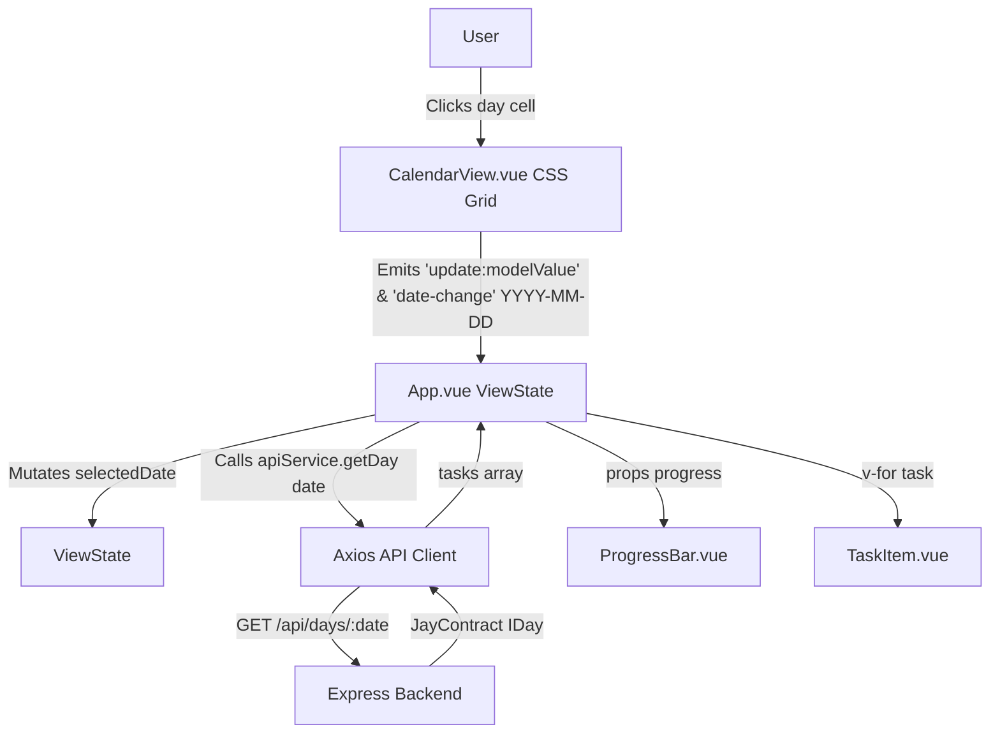
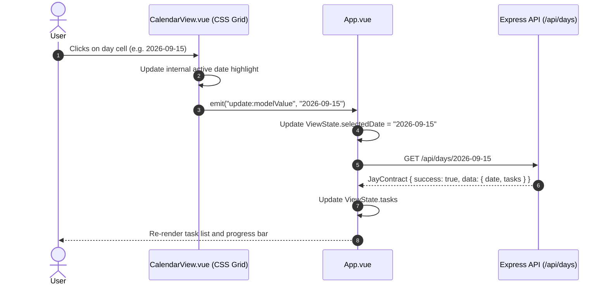

# Design Log #0002: Custom CSS Grid CalendarView Integration

## Background
In design log [#0001](file:///E:/DailyTracker/design-log/0001-daily-tracker-architecture.md), the foundational MEVN stack architecture and API contracts ([`JayContract`](file:///E:/DailyTracker/design-log/0001-daily-tracker-architecture.md#L94-L107)) were established. The initial date selector relied on a standard HTML date input.
The user requested an interactive calendar component (`CalendarView.vue`) structured with handwritten CSS Grid. When a user clicks any day cell on the calendar grid, the component must emit the selected date as a string in `YYYY-MM-DD` format to the parent page ([`App.vue`](file:///E:/DailyTracker/frontend/src/App.vue)), triggering an API call to load the tasks for that date.

## Problem
1. A standard `<input type="date">` does not offer an overview of the full month or immediate visual context of days.
2. The user requires a custom CSS Grid layout (`repeat(7, 1fr)`) without bloated third-party calendar libraries.
3. The component must handle month navigation (previous/next month, jump to today), correct day alignment based on the day of week (Monday to Sunday), visual indicators for today and selected dates, and padding days from adjoining months.
4. Clicking any day cell must emit the `YYYY-MM-DD` date string conforming to the existing [`JayContract`](file:///E:/DailyTracker/design-log/0001-daily-tracker-architecture.md#L94-L107) and [`ViewState`](file:///E:/DailyTracker/design-log/0001-daily-tracker-architecture.md#L109-L121) date specifications.

## Questions and Answers

### Q1: Which day should the calendar week start on?
**Answer:** Following ISO 8601 and regional convention (Vietnam/International), the week starts on Monday (Thứ 2) and ends on Sunday (Chủ Nhật).

### Q2: How are adjoining month padding days represented and handled?
**Answer:** If the 1st day of the month starts on Wednesday, Monday and Tuesday are filled with days from the end of the previous month. Trailing slots in the final row are filled with days from the start of the next month. Clicking any padding day emits that date and automatically switches the active month view.

### Q3: What events will `CalendarView.vue` emit?
**Answer:** It emits both `update:modelValue` (supporting Vue `v-model`) and `date-change` with the payload string `YYYY-MM-DD`.

## Design

### Component Architecture & Data Flow



### Grid Generation Sequence



### Type Signatures and Contracts

#### File: `frontend/src/components/CalendarView.vue`
```typescript
interface CalendarDay {
  date: string;       // Formatted as YYYY-MM-DD
  dayNumber: number;  // 1 to 31
  isCurrentMonth: boolean;
  isToday: boolean;
  isSelected: boolean;
}

interface CalendarViewProps {
  modelValue: string; // YYYY-MM-DD
}

interface CalendarViewEmits {
  (e: 'update:modelValue', date: string): void;
  (e: 'date-change', date: string): void;
}
```

#### Validation Rules:
- Date string emitted must strictly match regex `/^\d{4}-\d{2}-\d{2}$/`.
- Month indices must stay between 0 and 11.
- Leap years correctly handled via native JavaScript `Date` constructor.

## Implementation Plan

### Step 1: Update Tests First (TDD)
1. Revise `frontend/tests/CalendarView.spec.js` to test:
   - Rendering of month header, weekday labels (7 columns), and calendar days grid.
   - Initial selection highlight matching `modelValue`.
   - Emitting `YYYY-MM-DD` when clicking a day cell.
   - Month navigation buttons (previous month, next month, today button).
   - Selection of days in adjoining months.

### Step 2: Implement CalendarView.vue
1. Implement handwritten CSS Grid structure:
   - Container with month/year header and navigation controls.
   - Weekday header grid (`display: grid; grid-template-columns: repeat(7, 1fr);`).
   - Day cells grid (`display: grid; grid-template-columns: repeat(7, 1fr); gap: 4px;`).
2. Implement reactive month navigation state:
   - `currentYear` and `currentMonth` initialized from `modelValue` or today's date.
   - Computed `calendarDays` generating 35 or 42 cell items with exact `YYYY-MM-DD` dates.
3. Emit `update:modelValue` and `date-change` on cell click.

### Step 3: Run Vitest Suite & Build Verification
1. Run `npm test` in `frontend/` and verify all tests pass.
2. Run `npm run build` in `frontend/` to ensure no compile errors.

## Examples

### Date String Emits
- ✅ Valid Emitted Date: `"2026-09-08"`
- ✅ Valid Emitted Date on month switch: `"2026-10-01"`
- ❌ Invalid Emitted Date: `"9/8/2026"` (non-standard format)
- ❌ Invalid Emitted Date: `""`

### Grid Structure Example
```html
<div class="calendar-grid">
  <!-- 7 columns: T2, T3, T4, T5, T6, T7, CN -->
  <div class="weekday-header">...</div>
  <!-- Day cells with .is-selected, .is-today, .other-month -->
  <button class="day-cell is-selected">8</button>
</div>
```

## Trade-offs
1. **Handwritten CSS Grid vs Third-Party Library (e.g. FullCalendar / V-Calendar):**
   - *Chosen:* Handwritten CSS Grid with native Vue reactivity.
   - *Rationale:* Zero external dependencies, minimal bundle footprint (< 3KB vs 100KB+), complete design alignment with the existing Daily Tracker aesthetic.
2. **Fixed 42-cell Grid vs Variable 28-35 cell Grid:**
   - *Chosen:* Dynamic row calculation (5 or 6 rows = 35 or 42 cells) ensuring the grid perfectly fills complete weeks.
   - *Rationale:* Consistent layout without broken row heights across months of different day lengths.

## Implementation Results

- **Frontend TDD (CalendarView):** 5/5 unit tests passed in [`frontend/tests/CalendarView.spec.js`](file:///E:/DailyTracker/frontend/tests/CalendarView.spec.js).
  - 7 weekday header columns & day grid rendering: ✅ Passed
  - Selected date styling (`.is-selected`) & attribute mapping: ✅ Passed
  - Emitting `update:modelValue` and `date-change` with `YYYY-MM-DD` upon clicking day cells: ✅ Passed
  - Month navigation (previous/next month buttons): ✅ Passed
  - Quick "Hôm nay" jump and emission: ✅ Passed
- **Overall Frontend Test Suite:** 12/12 unit tests passing across all components.
- **Frontend Production Build:** Vite production build (`vite build`) completed successfully with 0 warnings/errors, bundling in 1.10s.

### Deviations
- **Dual Event Emission:** In addition to emitting `update:modelValue` (for seamless standard Vue `v-model` binding), the component also explicitly emits `date-change` as requested, allowing direct semantic event handling on the parent page [`App.vue`](file:///E:/DailyTracker/frontend/src/App.vue).
- **Date Indicator Banner:** Added a Vietnamese localized date badge in [`App.vue`](file:///E:/DailyTracker/frontend/src/App.vue) (`formattedSelectedDate`) to give users immediate feedback on the selected day above the task list and progress bar.

