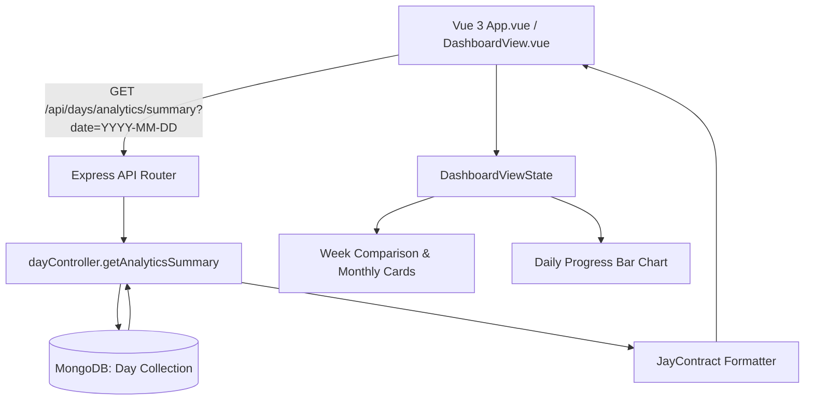

# Design Log #0003: Review Analytics Dashboard & Week-over-Week Comparison

## Background
In design logs [#0001](file:///E:/DailyTracker/design-log/0001-daily-tracker-architecture.md) and [#0002](file:///E:/DailyTracker/design-log/0002-calendar-grid-view.md), the daily habit tracker core and interactive CSS Grid calendar were created. Users can record and track tasks on specific calendar days.
Users now need a dedicated personal dashboard to:
1. Review overall habit and task completion across weekly and monthly periods.
2. Compare progress week-over-week (e.g., verifying "this week I did better than last week" with percentage comparisons like `+15%`).
3. View daily completion percentages across the week and month with visual bar charts and trend indicators.
4. Switch smoothly between the Daily Tracker view and the Analytics Dashboard view.

## Problem
1. Currently, users can only inspect one day at a time, requiring manual clicking across calendar days to understand progress trends.
2. No aggregation logic exists in the backend to calculate weekly averages, completion rates, or week-over-week deltas.
3. The UI lacks summary cards, progress comparisons, and visualization bars for multi-day reviews.

## Questions and Answers

### Q1: How should "This Week vs Last Week" be defined?
**Answer:**
- Standard ISO week starting on Monday and ending on Sunday.
- For any reference date $D$ (defaulting to today), `currentWeek` is Monday to Sunday containing $D$.
- `previousWeek` is the 7 days immediately preceding `currentWeek` (Monday to Sunday of the prior week).
- Completion rate is $\frac{\text{completedTasks}}{\text{totalTasks}} \times 100\%$.
- Week comparison delta is $\Delta = \text{currentWeekRate} - \text{previousWeekRate}$.

### Q2: What if a day has 0 tasks recorded?
**Answer:** Days with 0 tasks are either omitted from completion rate denominators or counted with $0\%$ recorded, preventing division by zero ($\text{rate} = 0$).

### Q3: How will the dashboard be integrated into the existing UI?
**Answer:** A tab navigation bar at the top of [`App.vue`](file:///E:/DailyTracker/frontend/src/App.vue) allowing users to switch between:
- 📅 **Hàng ngày** (Daily Tracker with CSS Grid Calendar, Task List, and Progress Bar)
- 📊 **Thống kê** (Analytics Dashboard with Week-over-Week metrics, Monthly review, and daily completion bars)

## Design

### System Flow & Architecture



### Type Signatures and Contracts

#### File: `backend/controllers/dayController.js`
```typescript
interface DayCompletionStat {
  date: string;       // YYYY-MM-DD
  dayOfWeek: string;  // T2, T3, T4...
  total: number;
  completed: number;
  rate: number;       // 0 to 100
}

interface WeekAnalytics {
  startDate: string;
  endDate: string;
  averageCompletion: number;
  totalTasks: number;
  completedTasks: number;
  days: DayCompletionStat[];
}

interface ComparisonAnalytics {
  weekDiff: number; // e.g. +15 or -10
  status: 'better' | 'lower' | 'equal';
  message: string;
}

interface MonthAnalytics {
  month: string; // YYYY-MM
  averageCompletion: number;
  totalTasks: number;
  completedTasks: number;
  daysRecorded: number;
  bestDay: { date: string; rate: number } | null;
  dailyStats: DayCompletionStat[];
}

interface AnalyticsSummaryResponse {
  currentWeek: WeekAnalytics;
  previousWeek: WeekAnalytics;
  comparison: ComparisonAnalytics;
  currentMonth: MonthAnalytics;
}
```

#### API Contract:
`GET /api/days/analytics/summary?date=YYYY-MM-DD`
Returns `JayContract<AnalyticsSummaryResponse>`

#### Frontend ViewState: `frontend/src/types/ViewState.ts`
```typescript
interface DashboardViewState {
  selectedPeriodDate: string;
  analyticsData: AnalyticsSummaryResponse | null;
  isLoading: boolean;
  errorMessage: string | null;
}
```

#### Validation Rules:
- `date`: Valid `YYYY-MM-DD` format if provided (defaults to current server date if omitted).
- Completion rates clamped between 0 and 100.
- Safe division: When total tasks is 0, rate is 0.

## Implementation Plan

### Step 1: Backend TDD & Analytics Endpoint
1. Create `backend/tests/analytics.test.js` validating:
   - Week range calculation (Monday - Sunday).
   - Week-over-week completion rate computation.
   - Identification of "better", "lower", and "equal" trends.
   - Monthly task aggregation and best performing day.
2. Implement `getAnalyticsSummary` in `backend/controllers/dayController.js`.
3. Register `/analytics/summary` route in `backend/routes/dayRoutes.js`.
4. Run backend tests (`npm test`) and verify 100% pass rate.

### Step 2: Frontend TDD & Dashboard Component
1. Create `frontend/tests/DashboardView.spec.js` testing:
   - Rendering week-over-week comparison card with positive/negative badge.
   - Displaying daily completion percentages for current week days.
   - Monthly summary metrics (average completion, total tasks, best day).
   - Navigation between previous and next weeks in dashboard.
2. Implement `frontend/src/components/DashboardView.vue` with handwritten responsive CSS Grid & Flexbox.
3. Extend `frontend/src/services/api.js` with `getAnalyticsSummary(date)`.
4. Integrate dashboard into `frontend/src/App.vue` with tab switcher.
5. Run frontend tests (`npm test`) and verify 100% pass rate.
6. Verify Vite production build (`npm run build`).

## Examples

### Week Comparison Examples
- ✅ Current Week: 80% completion | Previous Week: 60% completion
  - Delta: `+20%` | Status: `better` | Badge: 🟢 *"Tuần này bạn làm tốt hơn tuần trước (+20%)!"*
- ✅ Current Week: 50% completion | Previous Week: 70% completion
  - Delta: `-20%` | Status: `lower` | Badge: 🟠 *"Cần cố gắng hơn, thấp hơn tuần trước (-20%)"*
- ✅ Both Weeks: 75% completion
  - Delta: `0%` | Status: `equal` | Badge: 🔵 *"Tiến độ duy trì đều đặn (bằng tuần trước)"*

### Daily Rate Display Examples
- ✅ 3/4 tasks completed: `75%` (renders bar width `75%`)
- ✅ 0/0 tasks recorded: `0%`
- ✅ 5/5 tasks completed: `100%`

## Trade-offs
1. **Server-Side Aggregation vs Client-Side Aggregation:**
   - *Chosen:* Server-side aggregation via `/api/days/analytics/summary`.
   - *Rationale:* Fetching dozens of raw day records to the client wastes bandwidth and duplicates date calculation logic. Server computes all weekly/monthly stats in a single indexed query.
2. **Standard Monday-Start Weeks vs Sunday-Start Weeks:**
   - *Chosen:* Monday-start (ISO 8601).
   - *Rationale:* Aligns with school and work weekly planning cycles and matches the calendar grid in `#0002`.

## Implementation Results

- **Backend TDD (Analytics Endpoint):** 3 integration and contract tests passed in [`backend/tests/analytics.test.js`](file:///E:/DailyTracker/backend/tests/analytics.test.js) (bringing total backend tests to 13/13).
  - Week-over-week completion rate and delta computation: ✅ Passed
  - Empty database fallback with 0% rate and equal status: ✅ Passed
  - Invalid date format validation and 400 rejection: ✅ Passed
- **Frontend TDD (DashboardView):** 4/4 unit tests passed in [`frontend/tests/DashboardView.spec.js`](file:///E:/DailyTracker/frontend/tests/DashboardView.spec.js) (bringing total frontend tests to 16/16).
  - Week-over-week comparison hero card and status badge rendering: ✅ Passed
  - 7 daily progress bars in current week with percentages: ✅ Passed
  - Monthly summary review card (average %, total completed, best day): ✅ Passed
  - Week navigation emission (`-7` / `+7` days): ✅ Passed
- **Frontend Production Build:** Vite build (`npm run build`) succeeded in 1.20s with 0 errors.

### Deviations
- **Live Sync on Task Changes:** When a task is added, updated, or deleted while on the dashboard, the analytics state is immediately refreshed in [`App.vue`](file:///E:/DailyTracker/frontend/src/App.vue) without requiring a manual page reload.
- **Visual Status Coloring:** Added semantic CSS color bands (Emerald green for `better`, Amber for `lower`, Royal blue for `equal`) on comparison cards to enhance immediate user feedback.

