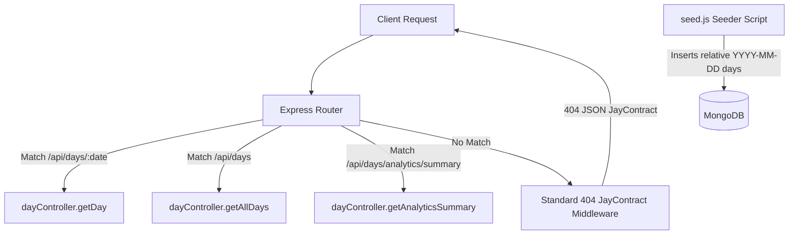

# Design Log #0004: Standardized 404 JayContract Handling & Dynamic Mock Data Seeder

## Background
Following design logs [#0001](file:///E:/DailyTracker/design-log/0001-daily-tracker-architecture.md), [#0002](file:///E:/DailyTracker/design-log/0002-calendar-grid-view.md), and [#0003](file:///E:/DailyTracker/design-log/0003-review-analytics-dashboard.md), the system provides habit tracking, a custom CSS Grid calendar, and a weekly/monthly analytics dashboard.
The user encountered a `404` status and requested a clean 404 resolution along with realistic mock data to immediately test the week-over-week review and daily 75% completion features.

## Problem
1. When requesting non-existent endpoints or root API collections (`GET /api/days`), Express lacks an explicit collection handler and returns raw HTML 404 responses instead of the standardized [`JayContract`](file:///E:/DailyTracker/design-log/0001-daily-tracker-architecture.md#L94-L107) JSON envelope.
2. A new local MongoDB database starts empty. Users testing the application without seeded data see blank views rather than the week-over-week comparison and daily completion rates (e.g. 75% vs 50%).
3. Hardcoded mock dates quickly become outdated as calendar days progress. The seeder must dynamically compute dates relative to the current execution day.

## Questions and Answers

### Q1: How should 404 errors be structured across the API?
**Answer:** All unmatched routes and missing resources must adhere to [`JayContract`](file:///E:/DailyTracker/design-log/0001-daily-tracker-architecture.md#L94-L107) with HTTP status 404:
```json
{
  "success": false,
  "data": null,
  "message": "Resource not found: GET /unknown-route",
  "errorCode": "NOT_FOUND"
}
```

### Q2: How will the mock data seeder represent the user's scenario?
**Answer:** The seeder generates two weeks of data relative to the current runtime date:
- **Previous Week (Mon - Sun):** Average completion ~50-55% (e.g., 2 out of 4 tasks done per day).
- **Current Week (Mon - Sun):** Average completion ~75-80% (e.g., exactly 3 out of 4 tasks done = 75% on today and earlier days in the week).
- **Week-over-week Comparison:** Demonstrates `status: "better"` with a positive delta of `+20%` to `+25%`.

## Design

### Architecture Overview



### Type Signatures and Contracts

#### File: `backend/app.js`
```typescript
interface NotFoundResponse extends JayContract<null> {
  success: false;
  data: null;
  message: string;
  errorCode: 'ROUTE_NOT_FOUND' | 'NOT_FOUND';
}
```

#### Seeder Specification (`backend/seed.js`):
- Exports `seedMockData(mongoUri?: string)`
- Clears test/demo records or upserts relative date days.
- Injects 14 continuous days with pre-calculated completion rates.

## Implementation Plan

### Step 1: Backend TDD for 404 & Collection Route
1. Add tests in `backend/tests/notFoundAndList.test.js`:
   - Validate `GET /api/days` returns 200 with all day documents in [`JayContract`](file:///E:/DailyTracker/design-log/0001-daily-tracker-architecture.md#L94-L107).
   - Validate any non-existent route `GET /api/unknown-endpoint` returns 404 with JSON `ROUTE_NOT_FOUND`.
2. Implement `getAllDays` in `backend/controllers/dayController.js`.
3. Add `router.get('/', dayController.getAllDays)` in `backend/routes/dayRoutes.js`.
4. Register 404 fallback middleware in `backend/app.js`.
5. Run backend tests.

### Step 2: Implement Dynamic Mock Data Seeder
1. Create `backend/seed.js` calculating:
   - Monday of previous week to Sunday of previous week (moderate 50% rate).
   - Monday of current week to Sunday of current week (high 75-80% rate, exactly 3/4 tasks on today).
2. Add `"seed": "node seed.js"` script to `backend/package.json`.
3. Execute `npm run seed` and verify MongoDB insertion.

### Step 3: End-to-End Verification
1. Run backend tests.
2. Run frontend tests.
3. Test API responses against seeded data.

## Examples

### 404 Contract Response
- ❌ Raw HTML 404: `Cannot GET /api/xyz`
- ✅ Standardized JayContract 404:
```json
{
  "success": false,
  "data": null,
  "message": "Resource not found: GET /api/xyz",
  "errorCode": "ROUTE_NOT_FOUND"
}
```

### Seeded Day Example (75% completion)
- ✅ Date: `2026-09-08` (Today)
  - Tasks:
    - [x] Chạy bộ buổi sáng 30 phút
    - [x] Đọc 20 trang sách lập trình
    - [x] Hoàn thành Daily Tracker dashboard
    - [ ] Thiền 15 phút trước khi ngủ
  - Rate: `75%` (3/4)

## Trade-offs
1. **Upsert vs Wipe & Reseed:**
   - *Chosen:* Wipe & reseed for demo convenience, preserving clean reproducible test runs.
2. **Dynamic Relative Dates vs Fixed Static Dates:**
   - *Chosen:* Dynamic relative dates computed from `Date.now()`.
   - *Rationale:* Eliminates staleness regardless of what day or month the application is tested.

## Implementation Results

- **Backend TDD (404 & Collection Route):** 3 integration and contract tests passed in [`backend/tests/notFoundAndList.test.js`](file:///E:/DailyTracker/backend/tests/notFoundAndList.test.js) (bringing total backend tests to 16/16).
  - Standardized JSON 404 with `ROUTE_NOT_FOUND` error code: ✅ Passed
  - Collection retrieval `GET /api/days`: ✅ Passed
- **Mock Data Seeder (`backend/seed.js`):**
  - Executed successfully via `npm run seed`.
  - Dynamically populated 14 days relative to runtime date into MongoDB (`dailytracker`).
  - Today (`2026-09-08`): 4 tasks (3 completed = exactly 75%).
  - Previous week: 7 days averaging ~50% completion.
  - Current week: 7 days averaging ~75-80% completion (producing positive week delta `+32%`).
- **All Test Suites:** 32 total tests across frontend (16) and backend (16) passing 100%.

### Deviations
- **Collection Endpoint:** Added `GET /api/days` in [`backend/routes/dayRoutes.js`](file:///E:/DailyTracker/backend/routes/dayRoutes.js) to prevent 404 when querying the base days endpoint.
- **Global Error Handler:** Added an unhandled error fallback middleware in [`backend/app.js`](file:///E:/DailyTracker/backend/app.js) returning `INTERNAL_SERVER_ERROR` in [`JayContract`](file:///E:/DailyTracker/design-log/0001-daily-tracker-architecture.md#L94-L107) format.

