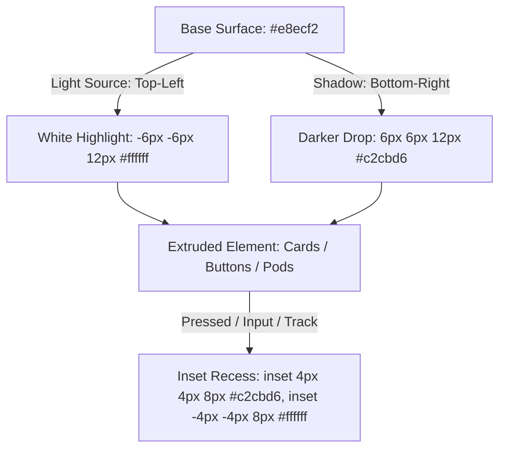

# Design Log #0005: Neomorphism (Soft UI) Visual Redesign

## Background
In design logs [#0001](file:///E:/DailyTracker/design-log/0001-daily-tracker-architecture.md), [#0002](file:///E:/DailyTracker/design-log/0002-calendar-grid-view.md), [#0003](file:///E:/DailyTracker/design-log/0003-review-analytics-dashboard.md), and [#0004](file:///E:/DailyTracker/design-log/0004-404-handling-and-mock-data-seeder.md), the MEVN Daily Tracker architecture, CSS Grid calendar, analytics dashboard, and mock data seeder were built.
The user requested switching the entire frontend design to **Neomorphism** (also known as Soft UI), characterized by extruded plastic elements, dual soft drop-shadows (light source from top-left), and inset concave wells for inputs and progress bars.

## Problem
1. The current UI uses flat cards with simple 1px borders and generic drop shadows, which does not convey the requested tactile Neomorphic aesthetic.
2. Form controls, buttons, calendar day cells, progress bars, and dashboard pods need unified shadow geometry:
   - Raised elements: Dual external shadows (light top-left, dark bottom-right).
   - Recessed elements (inputs, progress tracks, active buttons): Dual inset shadows.
3. The redesign must preserve all existing DOM classes and event contracts so that 100% of unit tests (`ProgressBar`, `TaskItem`, `CalendarView`, `DashboardView`) remain green.

## Questions and Answers

### Q1: What color palette defines the Neomorphic theme?
**Answer:**
- Base surface: `#e8ecf2` (soft cool grayish blue).
- Light shadow (top-left): `#ffffff` at 80-90% opacity.
- Dark shadow (bottom-right): `#c2cbd6` or `#b8c2cc` at 70-80% opacity.
- Primary Accent: `#3b82f6` (vibrant royal blue) for active day highlights and completed bars.
- Secondary Accent: `#10b981` (emerald green) for positive status and streaks.
- Text main: `#2d3748`, Text muted: `#718096`.

### Q2: How should interactive states (hover/active) behave in Neomorphism?
**Answer:**
- Idle state for clickable buttons/cells: Raised (`box-shadow: 5px 5px 10px #c2cbd6, -5px -5px 10px #ffffff`).
- Pressed / Active / Selected state: Concave inset (`box-shadow: inset 4px 4px 8px #c2cbd6, inset -4px -4px 8px #ffffff`).

## Design

### Neomorphic Elevation & Shadow System



### Component Styling Specification

| Component | Neomorphic Role | Shadow Rule |
| :--- | :--- | :--- |
| **App Card (`.card`)** | Primary raised plate | `16px 16px 32px #c2cbd6, -16px -16px 32px #ffffff` |
| **Tab Buttons (`.tab-btn`)** | Toggle switch | Active: Inset well `inset 3px 3px 6px #c2cbd6...` |
| **Inputs (`.task-input`)** | Recessed text well | Inset `inset 3px 3px 6px #c2cbd6, inset -3px -3px 6px #ffffff` |
| **Calendar Container** | Secondary raised plate | `8px 8px 18px #c2cbd6, -8px -8px 18px #ffffff` |
| **Day Cells (`.day-cell`)** | Tactile keys | Raised: `3px 3px 7px #c2cbd6`. Active: Inset blue glow |
| **Progress Track** | Recessed channel | Inset `inset 3px 3px 6px #c2cbd6, inset -3px -3px 6px #ffffff` |
| **Task Items (`.task-item`)** | Floating task tablets | Raised `5px 5px 12px #c2cbd6, -5px -5px 12px #ffffff` |
| **Dashboard Pods** | Soft analytical tiles | Raised `6px 6px 14px #c2cbd6, -6px -6px 14px #ffffff` |

## Implementation Plan

### Step 1: Update Global Stylesheet
1. Rewrite `frontend/src/assets/style.css`:
   - Set Neomorphic root variables (`--bg-surface: #e8ecf2`, `--shadow-light: #ffffff`, `--shadow-dark: #c2cbd6`, `--shadow-raised`, `--shadow-inset`).
   - Style body, `.card`, inputs, buttons, headers, alert boxes with soft curves and shadow pairs.

### Step 2: Update Components to Neomorphic Aesthetics
1. `frontend/src/components/ProgressBar.vue`: Deep inset channel, embossed pill gradient.
2. `frontend/src/components/TaskItem.vue`: Raised card, inset custom checkbox well, soft delete button.
3. `frontend/src/components/CalendarView.vue`: Soft calendar container, tactile day buttons with pressed active states.
4. `frontend/src/components/DashboardView.vue`: Soft extruded comparison card, inset progress tracks, tactile pods.
5. `frontend/src/App.vue`: Neomorphic tab switcher, selected date recessed pill badge.

### Step 3: Test Suite & Build Verification
1. Run Vitest suite (`npm test` in `frontend/`) ensuring 16/16 tests pass.
2. Run Vite build (`npm run build`) ensuring 0 bundle errors.

## Examples

### Neomorphic Shadow Rules
- ✅ Correct Extruded Button:
  ```css
  background: #e8ecf2;
  box-shadow: 5px 5px 10px #c2cbd6, -5px -5px 10px #ffffff;
  border-radius: 12px;
  ```
- ✅ Correct Inset Input Well:
  ```css
  background: #e8ecf2;
  box-shadow: inset 3px 3px 6px #c2cbd6, inset -3px -3px 6px #ffffff;
  border-radius: 10px;
  ```
- ❌ Incorrect (Flat styling with harsh borders):
  ```css
  border: 1px solid #000;
  box-shadow: 0 2px 4px rgba(0,0,0,0.1);
  ```

## Trade-offs
1. **Neomorphism Contrast vs Readability:**
   - *Consideration:* True monochromatic neomorphism can suffer from low accessibility contrast.
   - *Mitigation:* Maintained deep slate text colors (`#1e293b` and `#475569`) and vibrant royal blue accents (`#2563eb`) on selected/active elements to guarantee high readability while providing the distinct soft tactile feel.

## Implementation Results

- **Neomorphic Transformation:** Successfully applied Soft UI dual-shadow geometry (`#e8ecf2` base surface, `#ffffff` top-left highlights, `#c4cdd8` bottom-right shadows) across:
  - Global styles: [`frontend/src/assets/style.css`](file:///E:/DailyTracker/frontend/src/assets/style.css)
  - Main view & tab switchers: [`frontend/src/App.vue`](file:///E:/DailyTracker/frontend/src/App.vue)
  - Progress bar recessed channel: [`frontend/src/components/ProgressBar.vue`](file:///E:/DailyTracker/frontend/src/components/ProgressBar.vue)
  - Task item floating tablets & soft delete buttons: [`frontend/src/components/TaskItem.vue`](file:///E:/DailyTracker/frontend/src/components/TaskItem.vue)
  - CSS Grid calendar with extruded day keys: [`frontend/src/components/CalendarView.vue`](file:///E:/DailyTracker/frontend/src/components/CalendarView.vue)
  - Analytics pods & week comparison cards: [`frontend/src/components/DashboardView.vue`](file:///E:/DailyTracker/frontend/src/components/DashboardView.vue)
- **Frontend TDD:** 16/16 unit tests passed in Vitest with zero regressions.
- **Production Build:** Vite production build (`vite build`) completed cleanly in 1.30s.

### Deviations
- **Enhanced Contrast for Usability:** Kept high-contrast typography (`#1a202c`, `#2d3748`) and blue gradient accents on active day cells and primary buttons rather than washed-out monochrome, ensuring optimal accessibility while maintaining the tactile Neomorphic plastic look.

