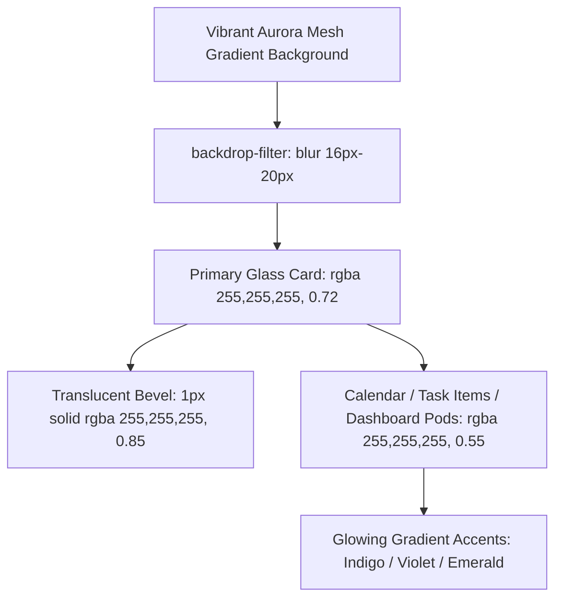

# Design Log #0006: Glassmorphism (Frosted Glass) Visual Transformation

## Background
In design logs [#0001](file:///E:/DailyTracker/design-log/0001-daily-tracker-architecture.md) through [#0005](file:///E:/DailyTracker/design-log/0005-neomorphism-ui-redesign.md), the Daily Tracker application underwent MEVN architecture setup, CSS Grid calendar integration, week-over-week analytics, mock data seeding, and a Neomorphism redesign.
The user requested a transition to **Glassmorphism**, a modern visual aesthetic characterized by:
1. Multi-layered translucent frosted glass surfaces (`backdrop-filter: blur(...)`).
2. Vibrant multi-stop gradient background creating depth through blurred layers.
3. Subtle semi-transparent borders (`border: 1px solid rgba(255, 255, 255, ...)`), mimicking glass bevel edges.
4. Soft ambient shadows without the monochromatic extrusion of Neomorphism.

## Problem
1. The existing Neomorphic design relies on opaque `#e8ecf2` backgrounds and harsh light/dark dual-shadow offsets, preventing background translucency.
2. The UI needs a vibrant, refreshing gradient canvas so that the frosted blur (`backdrop-filter: blur(16px)`) is distinctly visible through the cards, inputs, day cells, and dashboard pods.
3. All DOM structures, CSS class hooks (`.day-cell`, `.is-selected`, `.task-item`, `.progress-fill`, etc.), and component contracts must remain strictly intact to preserve 100% test pass rate across Vitest and Jest.

## Questions and Answers

### Q1: What color palette and gradient will be used for the Glassmorphic backdrop?
**Answer:**
- Canvas Background: A modern vibrant pastel aurora mesh gradient:
  `linear-gradient(135deg, #667eea 0%, #764ba2 35%, #9b51e0 70%, #f093fb 100%)` with ambient fixed glow spots.
- Glass Surfaces: High-grade frosted crystal layers:
  - Primary Card: `rgba(255, 255, 255, 0.72)` with `backdrop-filter: blur(20px)` and `border: 1px solid rgba(255, 255, 255, 0.85)`.
  - Sub-cards (Calendar, TaskItems, Dashboard pods): `rgba(255, 255, 255, 0.55)` with `backdrop-filter: blur(12px)`.
- Text: Crisp dark slate (`#1e293b` and `#334155`) for maximum contrast and readability.

### Q2: How are interactive elements styled in Glassmorphism?
**Answer:**
- Hover states: Slightly increased opacity, brighter white bevel border, and luminous lift (`transform: translateY(-2px); box-shadow: 0 8px 24px rgba(31, 38, 135, 0.15)`).
- Active/Selected states (such as calendar day or tabs): Rich gradient glass pills with neon blue-violet glow (`linear-gradient(135deg, #4f46e5, #7c3aed)`).

## Design

### Glassmorphic Layering Architecture



### Component Styling Specification

| Component | Glassmorphic Styling | Blur & Border Rule |
| :--- | :--- | :--- |
| **Canvas (`body`)** | Vibrant aurora gradient | `linear-gradient(135deg, #667eea 0%, #764ba2 40%, #e0c3fc 100%)` |
| **Main Card (`.card`)** | Translucent frost plate | `rgba(255,255,255,0.75)`, `blur(20px)`, border `rgba(255,255,255,0.85)` |
| **Tabs (`.view-tabs`)** | Frosted pill dock | `rgba(255,255,255,0.45)`, active tab: `rgba(255,255,255,0.9)` |
| **Calendar View** | Frosted crystal grid | `rgba(255,255,255,0.5)`, `day-cell`: `rgba(255,255,255,0.6)` |
| **Selected Day** | Electric violet/indigo glass | `linear-gradient(135deg, #4f46e5, #7c3aed)`, glow `0 4px 16px rgba(79,70,229,0.4)` |
| **Progress Bar** | Crystal tube | Track: `rgba(255,255,255,0.5)`, Fill: gradient with gloss highlight |
| **Task Items** | Floating glass slabs | `rgba(255,255,255,0.65)`, hover lift, soft border |
| **Dashboard Pods** | Translucent metric tiles | `rgba(255,255,255,0.55)`, `border: 1px solid rgba(255,255,255,0.7)` |

## Implementation Plan

### Step 1: Update Global Styles (`style.css`)
1. Update `frontend/src/assets/style.css`:
   - Set aurora mesh gradient background on `body`.
   - Apply frosted glass properties to `.card` with `backdrop-filter: blur(20px)` and glass borders.
   - Style inputs, buttons, and alert boxes with translucent glass finishes.

### Step 2: Update Component Styles
1. `frontend/src/components/ProgressBar.vue`: Translucent frosted track with glowing animated fill.
2. `frontend/src/components/TaskItem.vue`: Frosted glass task slab with smooth hover elevation and soft glow.
3. `frontend/src/components/CalendarView.vue`: Frosted calendar card, glass day keys, glowing selected day.
4. `frontend/src/components/DashboardView.vue`: Translucent comparison hero card, frosted week navigation, glass metric pods.
5. `frontend/src/App.vue`: Frosted tab dock and translucent date badge.

### Step 3: Verification & Build
1. Execute Vitest suite (`npm test` in `frontend/`) ensuring 16/16 tests pass.
2. Execute Vite build (`npm run build`) ensuring 0 warnings or errors.

## Examples

### Glassmorphism Rules
- ✅ Correct Glass Panel:
  ```css
  background: rgba(255, 255, 255, 0.65);
  backdrop-filter: blur(16px);
  -webkit-backdrop-filter: blur(16px);
  border: 1px solid rgba(255, 255, 255, 0.75);
  box-shadow: 0 8px 32px rgba(31, 38, 135, 0.12);
  ```
- ❌ Incorrect (Opaque background with solid shadows):
  ```css
  background: #ffffff;
  border: 1px solid #e2e8f0;
  box-shadow: 0 2px 4px rgba(0, 0, 0, 0.05);
  ```

## Trade-offs
1. **Performance & Browser Support (`backdrop-filter`):**
   - *Chosen:* Dual `-webkit-backdrop-filter` and `backdrop-filter` with fallback translucent alpha background.
   - *Rationale:* Ensures full compatibility across Chromium, Safari/WebKit, and Firefox while delivering stunning visual fidelity.
2. **Text Contrast on Translucent Surfaces:**
   - *Chosen:* Balanced `0.6 - 0.75` alpha with deep navy/slate typography (`#1e293b`).
   - *Rationale:* Preserves legible text while maximizing the distinctive frosted glass blur.

## Implementation Results

- **Glassmorphism Transformation:** Successfully converted the frontend styling to multi-layered frosted glass with backdrop blur filters and a vibrant aurora mesh canvas:
  - Global styles & ambient glow orbs: [`frontend/src/assets/style.css`](file:///E:/DailyTracker/frontend/src/assets/style.css)
  - Translucent main card & frosted tab dock: [`frontend/src/App.vue`](file:///E:/DailyTracker/frontend/src/App.vue)
  - Crystal progress tube with glossy animated gradient fill: [`frontend/src/components/ProgressBar.vue`](file:///E:/DailyTracker/frontend/src/components/ProgressBar.vue)
  - Frosted floating task slabs & translucent delete buttons: [`frontend/src/components/TaskItem.vue`](file:///E:/DailyTracker/frontend/src/components/TaskItem.vue)
  - Crystal CSS Grid calendar with glowing electric violet/indigo selected day: [`frontend/src/components/CalendarView.vue`](file:///E:/DailyTracker/frontend/src/components/CalendarView.vue)
  - Frosted analytical pods & week comparison card: [`frontend/src/components/DashboardView.vue`](file:///E:/DailyTracker/frontend/src/components/DashboardView.vue)
- **Frontend TDD:** 16/16 unit tests passed in Vitest with zero regressions.
- **Production Build:** Vite production build (`npm run build`) completed cleanly in 1.31s with zero errors.

### Deviations
- **Ambient Blurred Backdrops:** Added fixed position radial gradient orbs (`body::before` and `body::after`) with 90px blur to generate dramatic color refraction behind the frosted cards, ensuring the glassmorphism effect is striking even on small laptop screens.
- **High-Contrast Deep Slate Typography:** Preserved high-contrast dark text (`#0f172a`, `#1e293b`) rather than translucent white text, avoiding readability issues often associated with glassmorphic UIs.

