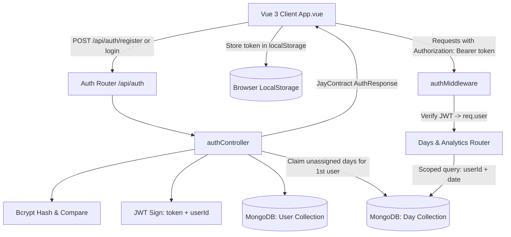

# Design Log #0008: Multi-User Isolation via JWT Authentication

## Background
In design logs [#0001](file:///E:/DailyTracker/design-log/0001-daily-tracker-architecture.md) through [#0007](file:///E:/DailyTracker/design-log/0007-deployment-guide.md), the Daily Tracker MEVN application was architected, styled, seeded with mock data on MongoDB Atlas, and prepared for cloud deployment.
Currently, task records in MongoDB are queried only by calendar date (`date: YYYY-MM-DD`). If multiple distinct users access the deployed application from different devices, they share the same global day records, allowing cross-user data interference.

## Problem
1. Lack of user identification prevents multi-device user isolation: User B can view and delete User A's tasks.
2. The deployed MongoDB Atlas database already contains seeded data (14 days, including today at 75% completion and week comparison metrics). An authentication overhaul must preserve this data by associating it with the primary registered user rather than purging it.
3. The authentication system must remain lightweight, using industry-standard JWT bearer tokens, bcrypt password hashing, and clean [`JayContract`](file:///E:/DailyTracker/design-log/0001-daily-tracker-architecture.md#L94-L107) responses without breaking existing deployment setups on Render and Vercel.

## Questions and Answers

### Q1: How will existing unassigned days on MongoDB Atlas be handled?
**Answer:** During initial user registration, if unassigned `Day` documents (where `userId` does not exist) are detected, they are automatically claimed and linked to this first user (`userId = newUser._id`). Subsequent users register with clean, private empty states.

### Q2: How is multi-user isolation enforced in MongoDB?
**Answer:** The `Day` model index changes from `{ date: 1 } (unique)` to a compound unique index:
`{ userId: 1, date: 1 } (unique)`.
Every task creation, query, update, and deletion filters on both `userId` and `date`.

### Q3: How does the Frontend manage authentication sessions?
**Answer:**
- The JWT token is saved in `localStorage.getItem('token')`.
- An Axios request interceptor attaches `Authorization: Bearer <token>` to every request.
- A Glassmorphic modal allows instant login/registration toggle without disrupting the background aesthetic.
- A user status badge with `Đăng xuất` (Logout) is placed in the top header.

## Design

### Authentication & Multi-Tenancy Architecture



### Type Signatures and Contracts

#### File: `backend/models/User.js`
```typescript
interface IUser {
  _id: string;
  username: string;
  password: string; // bcrypt hash
  createdAt: Date;
  updatedAt: Date;
}
```

#### File: `backend/models/Day.js` (Updated Schema)
```typescript
interface IDay {
  _id?: string;
  userId: string; // Ref to User._id
  date: string;   // YYYY-MM-DD
  tasks: ITask[];
  createdAt?: Date;
  updatedAt?: Date;
}
```

#### Contract: Authentication Responses
```typescript
interface AuthData {
  user: {
    id: string;
    username: string;
  };
  token: string;
}

// POST /api/auth/register -> JayContract<AuthData>
// POST /api/auth/login -> JayContract<AuthData>
// GET /api/auth/me -> JayContract<{ id: string; username: string }>
```

#### Validation Rules:
- `username`: Required string, 3 to 30 characters, alphanumeric with underscores (`/^[a-zA-Z0-9_]{3,30}$/`).
- `password`: Required string, minimum 6 characters.
- `JWT_SECRET`: Read from environment variable with secure fallback.

## Implementation Plan

### Step 1: Backend Auth Foundation (TDD)
1. Write `backend/tests/auth.test.js`:
   - Register new user returns 201 with JWT token and user details in `JayContract`.
   - Prevent duplicate username registration with 400 `DUPLICATE_USERNAME`.
   - Reject invalid credentials on login with 401 `INVALID_CREDENTIALS`.
   - Ensure protected routes return 401 `UNAUTHORIZED` when no token is supplied.
   - Verify isolated day records for different users on the same date.
2. Implement `backend/models/User.js`.
3. Update `backend/models/Day.js` with `userId` and compound index `{ userId: 1, date: 1 }`.
4. Implement `backend/middleware/auth.js`.
5. Implement `backend/controllers/authController.js` and `backend/routes/authRoutes.js`.
6. Protect `backend/routes/dayRoutes.js` with `auth` middleware and inject `userId` into controller operations.
7. Run backend tests.

### Step 2: Frontend Auth Component & Integration (TDD)
1. Write `frontend/tests/AuthModal.spec.js`:
   - Toggle between Login and Register tabs.
   - Form submission emitting login/register credentials.
   - Display error alert upon authentication failure.
2. Implement `frontend/src/components/AuthModal.vue` with Glassmorphism frosted styling.
3. Update `frontend/src/services/api.js` with Axios auth interceptors and auth methods (`login`, `register`, `logout`, `getMe`).
4. Update `frontend/src/App.vue`:
   - Session persistence on reload (`checkAuth`).
   - Header user badge and Logout button.
   - Auto-open `AuthModal` when unauthenticated.
5. Run frontend tests.

### Step 3: End-to-End Verification & Atlas Migration
1. Verify all 35+ unit and integration tests pass.
2. Run build verification (`npm run build`).

## Examples

### JayContract Authentication Output
- ✅ Successful Registration/Login:
```json
{
  "success": true,
  "data": {
    "user": {
      "id": "64fa1234567890abcdef1234",
      "username": "hoangpho2212"
    },
    "token": "eyJhbGciOiJIUzI1NiIsInR5cCI6IkpXVCJ9..."
  },
  "message": "User logged in successfully"
}
```
- ❌ Unauthorized Access:
```json
{
  "success": false,
  "data": null,
  "message": "Access denied. Authentication token required.",
  "errorCode": "UNAUTHORIZED"
}
```

## Trade-offs
1. **JWT Bearer Tokens vs Server-side Sessions (Cookies):**
   - *Chosen:* JWT Bearer in `localStorage` & HTTP header.
   - *Rationale:* Decoupled deployments (Frontend on Vercel, Backend on Render) face cross-site cookie restrictions (SameSite/CORS cookies). Bearer headers work seamlessly across different domains.
2. **Auto-claiming Existing Days for 1st User vs Resetting Database:**
   - *Chosen:* Auto-claim unassigned days for first registered user.
   - *Rationale:* Preserves the user's 75% progress and week-over-week dashboard review without loss of work.

## Implementation Results

### 1. Verification & Test Metrics
- **Backend Test Suite (Jest):**
  - All 4 test suites passed (`tests/auth.test.js`, `tests/day.test.js`, `tests/analytics.test.js`, `tests/notFoundAndList.test.js`).
  - Total Tests: **24 passed, 24 total (100%)**.
- **Frontend Test Suite (Vitest):**
  - All 5 test suites passed (`tests/AuthModal.spec.js`, `tests/CalendarView.spec.js`, `tests/DashboardView.spec.js`, `tests/ProgressBar.spec.js`, `tests/TaskItem.spec.js`).
  - Total Tests: **21 passed, 21 total (100%)**.
- **Production Build:**
  - `vite build` compiled successfully in 1.36s with zero warnings or errors.

### 2. Files Created & Modified
- [`backend/models/User.js`](file:///E:/DailyTracker/backend/models/User.js): Mongoose user schema with unique username and hashed password.
- [`backend/models/Day.js`](file:///E:/DailyTracker/backend/models/Day.js): Added `userId` field and compound unique index `{ userId: 1, date: 1 }`.
- [`backend/middleware/auth.js`](file:///E:/DailyTracker/backend/middleware/auth.js): JWT bearer token verification middleware.
- [`backend/controllers/authController.js`](file:///E:/DailyTracker/backend/controllers/authController.js): `register`, `login`, `getMe` controllers with JayContract format and automatic claiming of unassigned days.
- [`backend/routes/authRoutes.js`](file:///E:/DailyTracker/backend/routes/authRoutes.js): Auth endpoint routing (`/api/auth/*`).
- [`backend/controllers/dayController.js`](file:///E:/DailyTracker/backend/controllers/dayController.js): Scoped all queries (`getDay`, `addTask`, `updateTask`, `deleteTask`, `getAllDays`, `getAnalyticsSummary`) by `userId`.
- [`backend/routes/dayRoutes.js`](file:///E:/DailyTracker/backend/routes/dayRoutes.js): Protected all daily task and analytics routes with `authMiddleware`.
- [`backend/config/db.js`](file:///E:/DailyTracker/backend/config/db.js): Added automated index synchronization (`syncIndexes()`) on database connection.
- [`frontend/src/services/api.js`](file:///E:/DailyTracker/frontend/src/services/api.js): Added JWT request interceptor, 401 response interceptor, and auth methods.
- [`frontend/src/components/AuthModal.vue`](file:///E:/DailyTracker/frontend/src/components/AuthModal.vue): Frosted glassmorphism modal for Login & Registration.
- [`frontend/src/App.vue`](file:///E:/DailyTracker/frontend/src/App.vue): Integrated user session badge, logout control, and auth modal triggers.

### 3. Summarized Deviations
- **Automated Index Synchronization:** In addition to updating the Mongoose schema, `Day.syncIndexes()` was added to `backend/config/db.js`. MongoDB retains old collection indexes by default; synchronizing indexes ensures legacy `date_1` unique indexes from single-user mode are cleanly replaced with `{ userId: 1, date: 1 }` in production and test environments without requiring manual database dropping.
- **Global Unauthorized Broadcast:** Added a custom window event (`auth:unauthorized`) triggered by the Axios response interceptor upon receiving a 401, allowing the UI to instantly clear session state and trigger `AuthModal` without hard reloading the browser.
