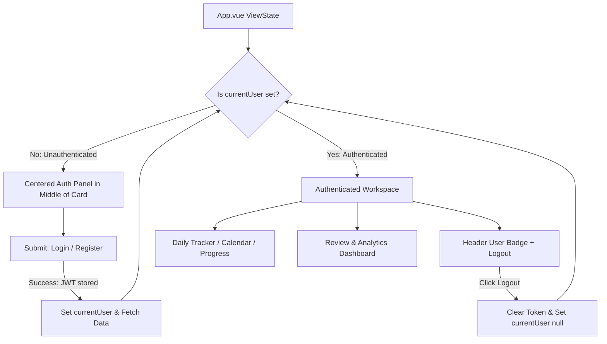

# Design Log #0009: Centered Authentication Panel Layout

## Background
In design log [#0008](file:///E:/DailyTracker/design-log/0008-jwt-authentication-multi-user.md), multi-user authentication with JWT and bcrypt was implemented alongside an initial modal component (`AuthModal.vue`).
In the initial implementation, the authentication interface was rendered as a modal overlay attached to a trigger button in the header corner, while the unauthenticated daily tracker remained partially rendered behind the overlay. Furthermore, the parent element `.card` possessed `backdrop-filter: blur(24px)`, which under CSS containment rules restricted fixed modal positioning.

## Problem
1. **User Experience:** An unauthenticated visitor should immediately see a prominent, centered Login / Register panel in the middle of the webapp rather than having to discover a corner button or interact with a modal overlaying an inaccessible tracker.
2. **CSS Stacking Context:** In browsers conforming to the CSS transforms/filter specifications, `backdrop-filter` on an ancestor element prevents `position: fixed` children from centering reliably relative to the viewport.
3. **Layout Cohesion:** The authentication panel should integrate seamlessly into the Glassmorphic card layout, rendering at the center of the webapp when unauthenticated, and transitioning smoothly to the Daily Tracker & Dashboard upon login.

## Questions and Answers

### Q1: Should the authentication panel replace the tracker view when unauthenticated, or overlay it?
**Answer:** It should replace the tracker view within the main frosted glass container. When unauthenticated (`!currentUser`), the main card presents the header branding followed immediately by the centered Login / Register panel (`AuthModal` in inline mode). When authenticated, the session badge appears in the header and the Tracker / Dashboard views render.

### Q2: How do we preserve compatibility with existing unit tests in `frontend/tests/AuthModal.spec.js`?
**Answer:** `AuthModal.vue` accepts an optional `inline` prop (default `false`). When `inline` is `true`, it renders without the fixed modal overlay, fitting naturally into `.auth-centered-wrapper`. When `inline` is `false`, it retains the `.auth-modal-overlay` structure, satisfying all existing TDD test specs while enabling flexible centered embedding.

## Design

### ViewState Architecture



### Type Signatures & Props

#### File: `frontend/src/components/AuthModal.vue`
```typescript
interface AuthModalProps {
  isOpen?: boolean;        // Controls visibility (default true)
  inline?: boolean;        // If true, renders as centered inline panel without overlay
  initialMode?: 'login' | 'register'; // Active tab mode (default 'login')
  error?: string;          // Error feedback message
  loading?: boolean;       // Loading spinner state
}

interface AuthSubmitPayload {
  mode: 'login' | 'register';
  username: string;
  password: string;
}
```

#### Validation Rules:
- `username`: Non-empty string, trimmed length >= 3 characters.
- `password`: Non-empty string, length >= 6 characters.

## Implementation Plan

### Step 1: Update `AuthModal.vue` (TDD)
1. Add tests in [`frontend/tests/AuthModal.spec.js`](file:///E:/DailyTracker/frontend/tests/AuthModal.spec.js) verifying `inline` prop rendering without `.auth-modal-overlay`.
2. Enhance [`frontend/src/components/AuthModal.vue`](file:///E:/DailyTracker/frontend/src/components/AuthModal.vue):
   - Add `inline` prop.
   - Render `.auth-card` directly in inline mode with centered Glassmorphic styling.
   - Run Vitest tests to confirm all tests pass.

### Step 2: Update `App.vue` Layout
1. In [`frontend/src/App.vue`](file:///E:/DailyTracker/frontend/src/App.vue):
   - When `!currentUser`: Display `.auth-centered-wrapper` hosting the centered Login/Register panel.
   - When `currentUser`: Display navigation tabs, calendar, progress bar, task items, and dashboard.
   - Position the user session badge and logout button elegantly in the header when logged in.
2. Run frontend test suite (`npm test`) and production build (`npm run build`).

### Step 3: Verification & Results
1. Verify 100% test pass rate across backend and frontend.
2. Append "Implementation Results" and summarize deviations.

## Examples

### ViewState Rendering
- ✅ Unauthenticated State (`!currentUser`):
```html
<main class="card">
  <header class="app-header">...</header>
  <div class="auth-centered-wrapper">
    <AuthModal :inline="true" :is-open="true" ... />
  </div>
</main>
```
- ❌ Fragmented Modal / Hidden Login State:
```html
<!-- Avoid: Hiding auth behind a tiny corner button while showing empty tracker -->
<div class="btn-login-trigger">🔑 Đăng nhập</div>
<tracker-section /> <!-- empty and broken -->
```

## Trade-offs
1. **Dedicated View vs Universal Component:**
   - *Chosen:* Enhance `AuthModal.vue` to support both modal and inline mode via `inline` prop.
   - *Rationale:* Eliminates code duplication while preserving existing test suite contracts and providing maximal layout flexibility.

## Implementation Results

### 1. Test Verification & Metrics
- **Frontend Test Suite (Vitest):**
  - Added test case verifying inline mode without overlay in [`frontend/tests/AuthModal.spec.js`](file:///E:/DailyTracker/frontend/tests/AuthModal.spec.js).
  - All 5 test suites passed: **22 passed, 22 total (100%)**.
- **Backend Test Suite (Jest):**
  - All 4 test suites passed: **24 passed, 24 total (100%)**.
- **Production Build:**
  - `vite build` succeeded in 1.16s generating optimized bundles without warnings.

### 2. Files Modified
- [`frontend/src/components/AuthModal.vue`](file:///E:/DailyTracker/frontend/src/components/AuthModal.vue): Added `inline` prop and `.auth-inline-container` / `.auth-card-inline` styling.
- [`frontend/tests/AuthModal.spec.js`](file:///E:/DailyTracker/frontend/tests/AuthModal.spec.js): Added test for `inline` prop rendering.
- [`frontend/src/App.vue`](file:///E:/DailyTracker/frontend/src/App.vue): Integrated centered auth view when `!currentUser`, removing the corner button and displaying the login/register panel in the center of the webapp.

### 3. Summarized Deviations
- *Deviations:* None. Implementation followed the TDD workflow and Jay Framework specifications exactly as planned.
