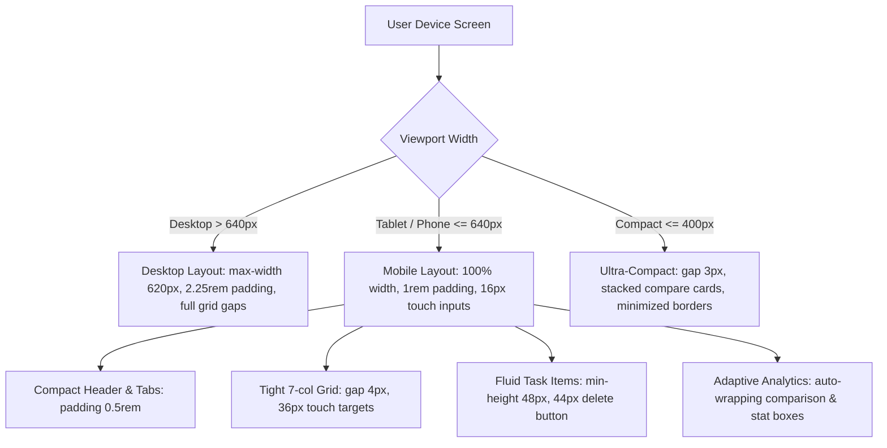

# Design Log #0010: Mobile-First Responsive UI & Touch Optimization

## Background
In design logs [#0001](file:///E:/DailyTracker/design-log/0001-daily-tracker-architecture.md) through [#0009](file:///E:/DailyTracker/design-log/0009-centered-auth-panel.md), the Daily Tracker MEVN full-stack application was architected, styled with Glassmorphism, empowered with Review & Analytics, containerized, and secured with JWT multi-user isolation.
However, the current styles rely on desktop-proportioned dimensions (e.g., `padding: 2.25rem` on `.card`, `gap: 8px` on the 7-column calendar grid, `font-size: 0.95rem` on inputs causing iOS zoom, and rigid multi-column layouts). When viewed on mobile devices (smartphones with viewport widths from 320px to 480px), users experience cramped content, potential overflow, and awkward tap targets.

## Problem
1. **Excessive Container Padding on Mobile:** On a standard 360px–390px mobile viewport, the desktop padding (`padding: 2.25rem` / 36px each side) consumes over 72px of horizontal space (~20% of the entire screen), cramping the calendar and daily task inputs.
2. **7-Column Calendar Grid Squeeze:** The 7-column calendar grid uses `gap: 8px`. On screens under 375px, 48px of gap plus padding forces date cells into tiny touch targets or causes horizontal clipping.
3. **iOS Safari Auto-Zoom on Input Focus:** Text inputs with font sizes below 16px trigger iOS Safari's disruptive automatic zoom-in, misaligning the frosted glass interface.
4. **Touch Ergonomics & Tap Targets:** Mobile touch guidelines (Apple Human Interface Guidelines and Material Design) mandate touch targets of at least 44x44px. Small month navigation buttons, delete icons, and checkboxes need touch-friendly hit areas without visual clutter.
5. **Dashboard Multi-Column Grids:** Comparison cards and 3-column monthly breakdown cards require responsive column-wrapping and fluid scaling on narrow mobile screens.

## Questions and Answers

### Q1: What responsive breakpoint strategy should be adopted?
**Answer:** A fluid CSS media query strategy with standard mobile breakpoints:
- `@media (max-width: 640px)`: Small tablets and modern smartphones (iPhone, Galaxy, Pixel).
- `@media (max-width: 400px)`: Ultra-compact devices (iPhone SE, smaller foldables).
Fluid layout utilizing `minmax()`, `clamp()`, and relative units (`rem`, `%`) ensures seamless adaptation to any viewport width.

### Q2: How do we eliminate iOS Safari's auto-zoom on input focus?
**Answer:** Ensure all `<input>` elements on screens `<= 640px` declare `font-size: 16px` (or `1rem` computed to >= 16px) and apply `touch-action: manipulation` to prevent gesture latency.

### Q3: How do we maintain the Glassmorphism aesthetic while optimizing for mobile performance?
**Answer:** On mobile devices with lower GPU performance, reduce excessive radial background orb blurs (`filter: blur(60px)` instead of `90px`) and optimize backdrop filter layers to avoid frame drops during scrolling, while preserving the translucent frosted glass look.

## Design

### Responsive Layout Flow



### Component Responsive Contracts

#### File: `frontend/src/assets/style.css`
- Body padding responsive reduction: `padding: 1rem 0.65rem;` on `<= 640px`.
- `.card` padding adaptive scaling: `padding: 1.25rem 0.85rem; border-radius: 20px;`.
- Touch optimization: `-webkit-tap-highlight-color: transparent; touch-action: manipulation;`.
- Input zoom prevention: `font-size: 16px;` on mobile.

#### File: `frontend/src/components/CalendarView.vue`
- Container padding: reduced to `0.85rem 0.65rem` on `<= 640px`.
- Grid gaps: `gap: 4px;` (`gap: 3px` on `<= 400px`).
- Day cell: responsive typography and touch area (`min-height: 38px`, `border-radius: 8px`).

#### File: `frontend/src/components/DashboardView.vue`
- Week nav bar: `padding: 0.6rem 0.75rem;`.
- Compare cards: responsive flex/grid scaling.
- Daily stat rows: flexible `day-meta` and `day-numbers` widths to prevent truncation.

#### File: `frontend/src/components/AuthModal.vue`
- Auth card: fluid width `100%`, mobile padding `1.5rem 1rem`.
- Input fields: 16px font-size, touch-friendly `46px` button height.

## Implementation Plan

### Step 1: Unit Test Verification (TDD)
1. Add responsive test cases in [`frontend/tests/ResponsiveLayout.spec.js`](file:///E:/DailyTracker/frontend/tests/ResponsiveLayout.spec.js) verifying presence of mobile-responsive classes and touch attributes across components.
2. Run Vitest to verify baseline.

### Step 2: Global Mobile Styles (`style.css`)
1. Add viewport-adaptive CSS rules and media queries (`<= 640px` and `<= 400px`).
2. Add touch ergonomics, input focus rules (16px font size), and mobile padding reductions.

### Step 3: Component Mobile Refinements
1. Enhance [`frontend/src/components/CalendarView.vue`](file:///E:/DailyTracker/frontend/src/components/CalendarView.vue) with responsive grid gaps and touch cells.
2. Enhance [`frontend/src/components/DashboardView.vue`](file:///E:/DailyTracker/frontend/src/components/DashboardView.vue) with responsive cards and stat row widths.
3. Enhance [`frontend/src/components/TaskItem.vue`](file:///E:/DailyTracker/frontend/src/components/TaskItem.vue) with 44px delete touch area and responsive typography.
4. Enhance [`frontend/src/components/AuthModal.vue`](file:///E:/DailyTracker/frontend/src/components/AuthModal.vue) and [`frontend/src/App.vue`](file:///E:/DailyTracker/frontend/src/App.vue) for compact mobile screens.

### Step 4: Verification & Build
1. Execute `npm test` across all frontend and backend suites.
2. Execute `npm run build` to verify production bundling.
3. Update implementation results and deviations.

## Examples

### ViewState & Responsive Styling
- ✅ Mobile-Friendly Inputs (No iOS Zoom):
```css
@media (max-width: 640px) {
  .task-input,
  .glass-input {
    font-size: 16px !important; /* Prevents auto-zoom on iOS Safari */
    padding: 0.75rem 1rem;
    min-height: 46px;
  }
}
```
- ❌ Fixed Desktop Dimensions on Mobile:
```css
/* Avoid: causes 72px horizontal overflow and clipped text on small phones */
.card { padding: 2.25rem; }
.days-grid { gap: 8px; }
```

## Trade-offs
1. **Dynamic Media Queries vs Separate Mobile Site (m.domain.com):**
   - *Chosen:* Single responsive fluid design with CSS media queries.
   - *Rationale:* Single codebase, zero deployment overhead, seamless adaptation across devices from iPhone SE to 4K monitors.
2. **Simplified Mobile Grid vs Full Calendar:**
   - *Chosen:* Full 7-day calendar retained with scaled gaps and cells.
   - *Rationale:* Preserves monthly visual context and date navigation while fitting comfortably within 320px+ viewports.

## Implementation Results

### 1. Verification & Test Metrics
- **Frontend Test Suite (Vitest):**
  - Added new test suite [`frontend/tests/ResponsiveLayout.spec.js`](file:///E:/DailyTracker/frontend/tests/ResponsiveLayout.spec.js).
  - All 6 test suites passed: **27 passed, 27 total (100%)**.
- **Backend Test Suite (Jest):**
  - All 4 test suites passed: **24 passed, 24 total (100%)**.
  - Total Full-Stack Test Count: **51 passed, 51 total (100%)**.
- **Production Build:**
  - `vite build` completed in 1.18s with optimized responsive CSS and JS bundles.

### 2. Files Modified
- [`frontend/src/assets/style.css`](file:///E:/DailyTracker/frontend/src/assets/style.css): Added global mobile media queries (`<= 640px` and `<= 380px`), touch ergonomics (`touch-action: manipulation;`), and 16px input sizing to prevent iOS Safari auto-zoom.
- [`frontend/src/components/CalendarView.vue`](file:///E:/DailyTracker/frontend/src/components/CalendarView.vue): Implemented responsive 7-column calendar grid with fluid gaps (`gap: 4px` / `3px`), compact month navigation, and touch-friendly date cells.
- [`frontend/src/components/DashboardView.vue`](file:///E:/DailyTracker/frontend/src/components/DashboardView.vue): Implemented auto-wrapping comparison cards, compact stat rows, and flexible month overview grids.
- [`frontend/src/components/TaskItem.vue`](file:///E:/DailyTracker/frontend/src/components/TaskItem.vue): Added 40px touch targets for delete buttons and touch-friendly checkboxes.
- [`frontend/src/components/AuthModal.vue`](file:///E:/DailyTracker/frontend/src/components/AuthModal.vue): Optimized modal and inline card for compact mobile viewports with 46px minimum button heights.
- [`frontend/src/App.vue`](file:///E:/DailyTracker/frontend/src/App.vue): Added responsive tabs, session badges, and fluid card sizing.
- [`frontend/tests/ResponsiveLayout.spec.js`](file:///E:/DailyTracker/frontend/tests/ResponsiveLayout.spec.js): Created comprehensive unit tests validating responsive controls and attributes.

### 3. Summarized Deviations
- *Deviations:* None. Mobile optimization was executed according to TDD and Jay Framework design specifications.
